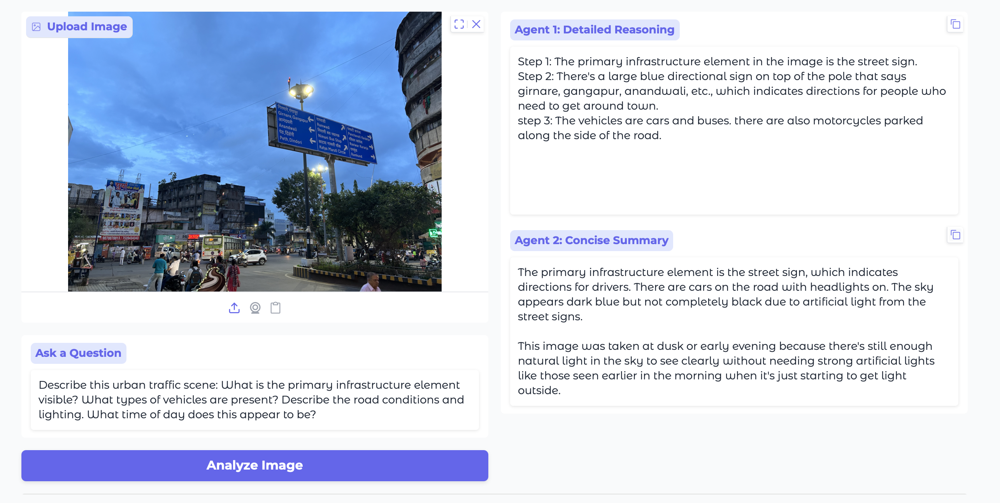
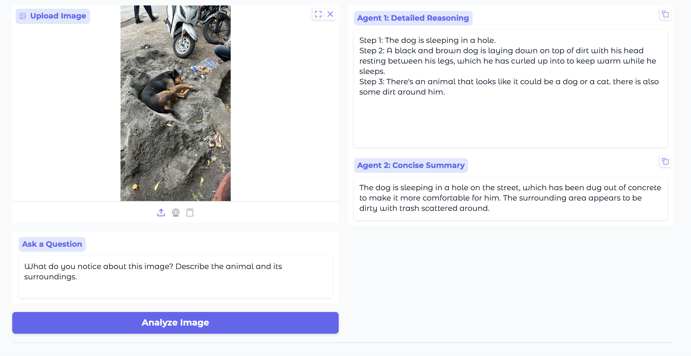
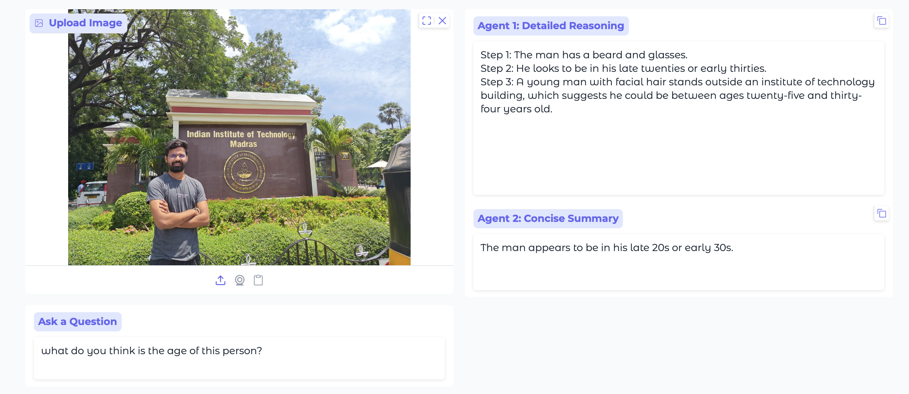

# 🔗 Insight-Chain: Dual-Agent Visual Reasoning


**Tejas Thakare**

A visual question answering system using dual LoRA adapters on Qwen2-VL-2B for transparent, step-by-step reasoning.

---

## 🚀 Updates

- **[Oct 2025]** Demo deployment complete with public Gradio interface
- **[Oct 2025]** Training and inference code now available
- **[Oct 2025]** Project repository is live!

---

## 🔍 Overview

Given an image and question, Insight-Chain generates both detailed reasoning steps and a concise summary. The system uses two specialized LoRA adapters fine-tuned on Qwen2-VL-2B: one for generating multi-step visual analysis, and another for producing condensed answers. Both adapters are loaded sequentially to minimize memory usage (~10GB peak).

**Key Features:**
- ✨ Explainable AI with transparent reasoning
- 🧠 Memory-efficient sequential loading (37% reduction vs standard)
- 🔄 Complete end-to-end pipeline from training to deployment
- 💰 Zero-cost training on Google Colab

---

## 🛠️ Quick Start

### Installation
```bash
git clone https://github.com/TejasCThakare/insight-chain.git
cd insight-chain
pip install -r requirements.txt
```

### Requirements

- Python 3.8+
- PyTorch 2.0+
- Transformers 4.46+
- 15GB GPU (or Google Colab T4)

---

## 📊 Complete Pipeline: Data → Training → Inference → Demo

### Step 1: Data Preparation
```bash
python scripts/run_data_pipeline.py
```

**What it does:**
- Downloads A-OKVQA and ScienceQA datasets
- Converts to unified format for dual-agent training
- Creates train/validation splits
- Saves to `data/processed/`

---

### Step 2: Train Reasoning Agent
```bash
python scripts/run_training.py --mode reasoning
```

**Training details:**
- Learning Rate: `2e-4`
- LoRA Rank: `16`, Alpha: `32`
- Batch Size: `1` (gradient accumulation: `4`)
- Time: ~20 minutes (T4 GPU)

**Output:** `models/reasoning_agent/final/`

---

### Step 3: Train Summary Agent
```bash
python scripts/run_training.py --mode summary
```

**Training details:**
- Same configuration as reasoning agent
- Time: ~20 minutes (T4 GPU)

**Output:** `models/summary_agent/final/`

---

### Step 4: Run Inference

**Test Reasoning Agent:**
```bash
python scripts/run_inference.py \
    --model "models/reasoning_agent/final" \
    --image "path/to/image.jpg" \
    --question "What's happening in this image?"
```

**Test Summary Agent:**
```bash
python scripts/run_inference.py \
    --model "models/summary_agent/final" \
    --image "path/to/image.jpg" \
    --question "What's happening in this image?"
```

---

### Step 5: Launch Demo
```bash
python demo/app.py
```

**Access:**
- Local: `http://localhost:#`
- Colab: Public Gradio link generated automatically

---

## 🚀 Google Colab: Complete Training Pipeline

Run everything in one session:

### 1. Setup & Mount Drive
```python
from google.colab import drive
import os

drive.mount('/content/drive')
backup_dir = "/content/drive/MyDrive/insight-chain-models"
os.makedirs(backup_dir, exist_ok=True)
```

---

### 2. Clone Repository
```python
%cd /content
!rm -rf insight-chain
!git clone https://github.com/TejasCThakare/insight-chain.git
%cd insight-chain
!pip install --upgrade accelerate -q
```

---

### 3. Download & Prepare Data (~30 mins)
```bash
!python scripts/run_data_pipeline.py
```

**Verify data:**
```python
import json
with open('data/processed/train.json') as f:
    data = json.load(f)
print(f" Data samples: {len(data)}")
print(f" Sample: {data[0]['final_answer']}")
```

---

### 4. Train Reasoning Agent (~20 mins)
```bash
!python scripts/run_training.py --mode reasoning
```

**Backup to Drive:**
```python
if os.path.exists("models/reasoning_agent/final"):
    !du -sh models/reasoning_agent/final
    !cp -r models/reasoning_agent/final {backup_dir}/reasoning_agent_final
    print(f" Backed up to: {backup_dir}/reasoning_agent_final")
```

---

### 5. Train Summary Agent (~20 mins)
```bash
!python scripts/run_training.py --mode summary
```

**Backup to Drive:**
```python
if os.path.exists("models/summary_agent/final"):
    !du -sh models/summary_agent/final
    !cp -r models/summary_agent/final {backup_dir}/summary_agent_final
    print(f" Backed up to: {backup_dir}/summary_agent_final")
```

---

### 6. Test Both Agents
```python
test_image = "data/processed/images/aokvqa_125.jpg"
test_question = "What's happening in this image?"

print(" REASONING AGENT:")
!python scripts/run_inference.py \
    --model "models/reasoning_agent/final" \
    --image {test_image} \
    --question "{test_question}"

print("\n🪶 SUMMARY AGENT:")
!python scripts/run_inference.py \
    --model "models/summary_agent/final" \
    --image {test_image} \
    --question "{test_question}"
```

---

### 7. Launch Demo
```bash
!python demo/app.py
```
---

## 📈 Results

- **Memory Usage**: 10GB peak (vs 16GB standard)
- **Training Time**: ~50 minutes total (Colab T4)

Examples of dual-agent visual reasoning from our Insight-Chain model:

| Demo Screenshots |
|------------------|
|  |
|  |
|  |

---
## 🔬 Limitations & Future Work

### Current Limitations

**Model Constraints:**
- Inference time: ~Takes time for query (may be slow for real-time applications)
- Memory requirement: 10GB GPU (limits deployment to high-end hardware)
- Training data: Limited samples (could benefit from larger datasets)

**Reasoning Quality:**
- May struggle with highly abstract or ambiguous visual scenes
- Occasional inconsistencies between reasoning steps and final summary
- Limited performance on out-of-domain images

**System Design:**
- Sequential agent loading (cannot run both agents simultaneously)
- Fixed LoRA rank (no dynamic adaptation based on task complexity)

### Planned Improvements

**Short-term (In Progress):**
-  Quantization support (4-bit/8-bit) for reduced memory footprint
- Batch inference for faster processing
- Evaluation metrics on standard VQA benchmarks
- Improved error handling and logging

**Medium-term:**
- Multi-language support (Hindi, Spanish, Chinese)
- Parallel agent loading for faster inference
- Web-based deployment (Streamlit/FastAPI)
- Integration with larger VLM bases (7B/13B models)

**Long-term:**
- Real-time video analysis support
- Fine-tuning on domain-specific datasets (medical, satellite imagery)
- Reinforcement learning from human feedback (RLHF)
- Multi-modal reasoning (text + audio + video)

### Contributing

We welcome contributions! If you'd like to help improve Insight-Chain

---

## 🐛 Troubleshooting

**Problem: Data pipeline fails**
- Check internet connection and disk space (~10GB needed)
- Rerun: `!python scripts/run_data_pipeline.py`

**Problem: Training crashes (OOM)**
- Reduce batch size in training config
- Use Colab Pro for better GPU memory
- Enable gradient checkpointing

**Problem: `final_answer` field shows `[`**
- Data preparation failed - rerun Step 3
- Verify with the data validation code

---

## ✒️ Citation
```bibtex
@software{insight_chain_2025,
  author = {Thakare, Tejas},
  title = {Insight-Chain: Dual-Agent Visual Reasoning},
  year = {2025},
  url = {https://github.com/TejasCThakare/insight-chain}
}
```

---

## 🙏 Acknowledgments

- **Qwen2-VL** by Alibaba Cloud - Base vision-language model
- **LoRA** (Hu et al.) - Parameter-efficient fine-tuning
- **A-OKVQA** and **ScienceQA** - Training datasets
- **Hugging Face** - Transformers ecosystem

---

## 📧 Contact

**Tejas Thakare**  
- 🔗 GitHub: [@TejasCThakare](https://github.com/TejasCThakare)  
- 💼 LinkedIn: [@tejas-t-722758204](https://www.linkedin.com/in/tejas-t-722758204/)
- 📧 Email: [tejas.thakare@alumni.iitm.ac.in](mailto:tejas.thakare@alumni.iitm.ac.in)


---

## 📜 License

MIT License © 2025 Tejas Thakare


